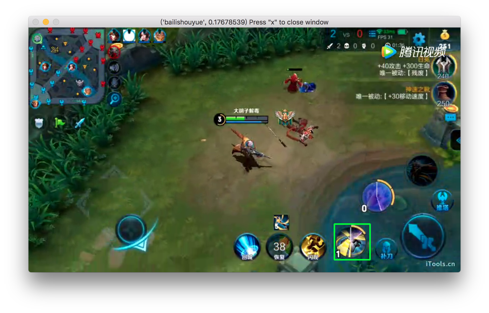

# HeroDetect

## 简介

王者荣耀第一视角游戏视频的英雄识别工具，通过第一技能识别 70 个英雄。

## 环境准备

```
sudo apt install python3 pip3
sudo pip3 install keras tensorflow h5py numpy ipython matplotlib
```

## 使用

复制文件 `model/cnn_vgg.label.txt` `model/cnn_vgg.model.h5` `detector.py`，并参考下面 demo 使用分类接口。

1. 输入游戏视频路径，返回识别结果

```
python3 demo_video.py
[('bailishouyue', 0.9166666666666666), ('chengjisihan', 0.041666666666666664), ('bianque', 0.03125), ('luna', 0.010416666666666666)]
```

2. 输入游戏截图，返回识别结果

```
python3 demo_frame.py
('bailixuance', 0.99969363)
```

3. 输入游戏视频路径，播放视频并实时显示识别结果

```
python3 demo_player.py
```

